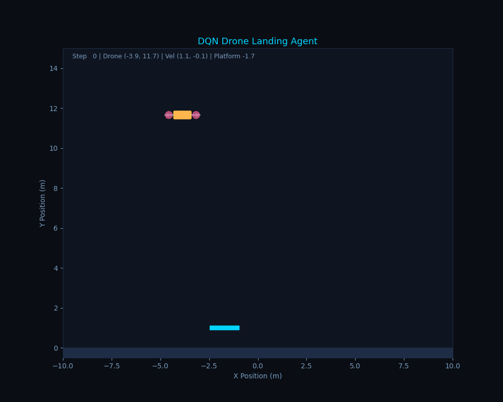
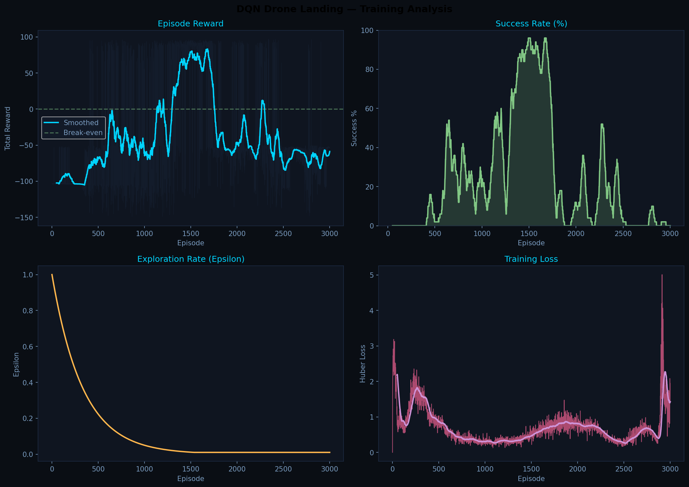

# DQN Drone Landing Agent

A deep reinforcement learning agent trained to land a drone on a moving platform — built from scratch with a custom 2D physics environment and DQN implementation in PyTorch.

---

## Demo



The agent attempts multiple episodes until a successful landing. Early attempts crash or miss the platform — by the final attempt the agent has learned to track and descend onto the moving target.

---

## Training Results



The agent goes from 0% success (pure random) to **96% success rate at peak** (episode ~1350), demonstrating a clear learning curve. Performance degrades after episode 1500 due to catastrophic forgetting — a known DQN limitation without prioritized experience replay.

---

## Environment

Custom 2D physics simulation — no gym, no external environment library.

| Parameter | Value |
|-----------|-------|
| State space | 6D: drone x/y, velocity x/y, platform x, platform velocity |
| Action space | 4: thrust left, thrust up, thrust right, no thrust |
| Gravity | -9.8 m/s² |
| Platform | Moving horizontally, bounces off walls |
| Landing condition | On platform, gentle velocity (< 3 m/s) |
| Max steps | 500 per episode |

**Rewards:**
- Successful landing: +100
- Crash / out of bounds: -100
- Per step: -0.1 (encourages efficiency)

---

## Architecture

```
State (6) → Linear(128) → ReLU → Linear(128) → ReLU → Q-values (4)
```

- **Double network** — online network trained every step, target network synced every 200 steps for stability
- **Experience replay** — 50,000 transition buffer, random batch sampling breaks correlation
- **Huber loss** — more stable than MSE for Q-learning
- **Epsilon-greedy** — decays from 1.0 to 0.01 over ~1000 episodes

---

## Training

```bash
python src/train.py
```

Default: 3000 episodes, batch size 64, lr=0.001, gamma=0.99

---

## Visualization

```bash
python notebooks/visualize_agent.py   # landing animation
python notebooks/plot_results.py      # training curves
```

---

## Project Structure

```
drone-landing-rl/
├── env/
│   └── drone_env.py        # custom 2D physics environment
├── src/
│   ├── dqn.py              # DQN agent, Q-network, replay buffer
│   ├── train.py            # training loop
│   └── test_env.py         # random agent baseline
├── notebooks/
│   ├── plot_results.py     # training analysis plots
│   └── visualize_agent.py  # landing animation
├── models/                 # saved checkpoints (not tracked)
└── docs/
    ├── training_analysis.png
    └── landing_demo.gif
```

---

## Known Limitations

- Landing detection allows approach from below — the drone can technically "land" by rising into the platform from underneath. A proper fix requires retraining with a directional constraint (`vy ≤ 0` at landing).
- Catastrophic forgetting after episode ~1500 — performance degrades without prioritized experience replay or learning rate scheduling.
- 2D only — real drone landing requires 6DOF dynamics.

---

## Author
Nassib El Saghir — [LinkedIn](https://linkedin.com/in/nassib-el-saghir) — [GitHub](https://github.com/nassib-es)